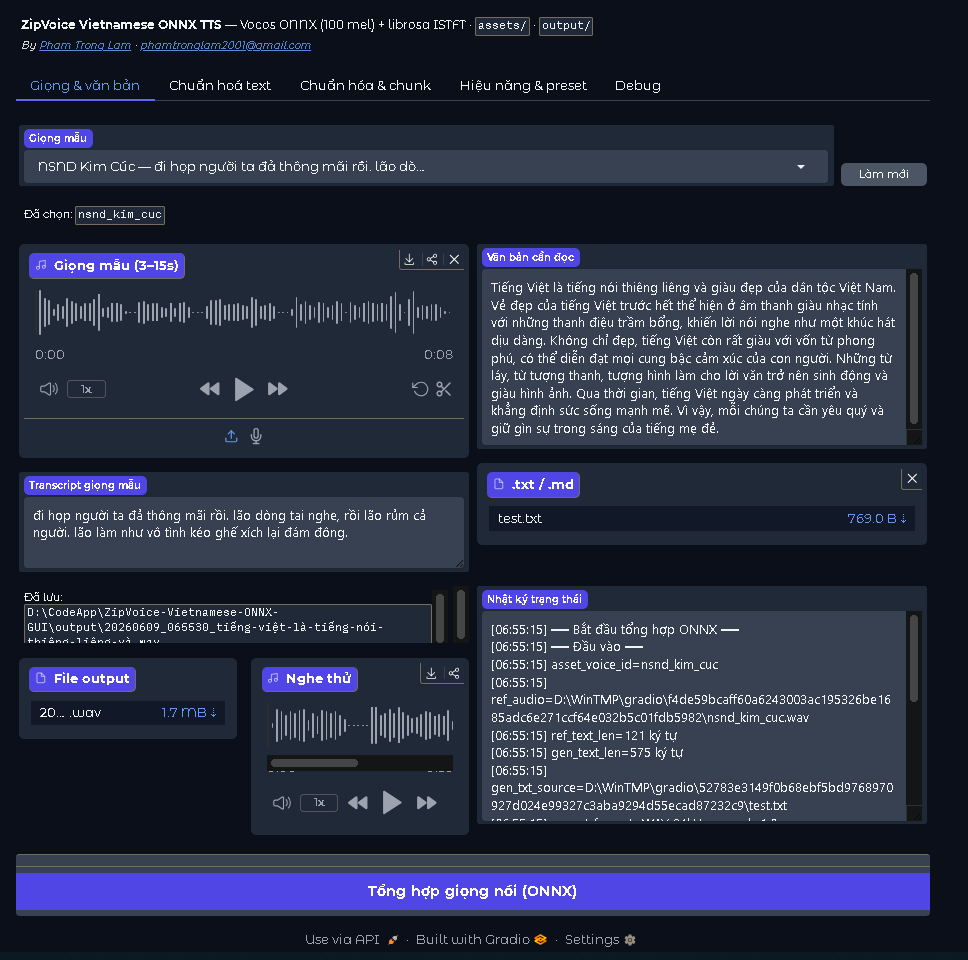

<div align="center">

# 🎙️ ZipVoice Vietnamese ONNX GUI

**TTS tiếng Việt zero-shot, chạy offline — sao chép giọng nói chỉ từ vài giây audio, hoàn toàn trên máy.**

[](https://www.python.org/)
[](https://onnxruntime.ai/)
[](https://www.gradio.app/)
[](https://github.com/phamtronglam2001/ZipVoice-Vietnamese-ONNX-GUI/releases/tag/v1.0.0)
[](LICENSE)

**[Pham Trong Lam](https://github.com/phamtronglam2001)** · [English](README.md)

</div>

---

## 📖 Giới thiệu

TTS tiếng Việt chất lượng cao thường đồng nghĩa với việc gửi văn bản lên API cloud trả phí — bất tiện với nội dung nhạy cảm về quyền riêng tư, sách nói, và các môi trường offline/cô lập mạng.

**ZipVoice Vietnamese ONNX GUI** chạy toàn bộ pipeline **ngay trên máy**: lượng tử hóa mô hình flow-matching [ZipVoice](https://github.com/k2-fsa/ZipVoice) sang **ONNX int4/int8**, ghép với vocoder Vocos 100-mel, và đóng gói trong ứng dụng **Gradio** thân thiện. Chỉ cần ~3–15 giây giọng mẫu kèm transcript, app sao chép giọng đó để đọc văn bản tiếng Việt bất kỳ — không cần GPU, không dữ liệu nào rời khỏi máy bạn.

> **Tóm gọn:** một hệ TTS neural end-to-end theo hướng production — lượng tử hóa mô hình, pipeline chuẩn hóa text tùy biến, suy luận chunk song song, và GUI hoàn chỉnh — xây dựng cho **sách nói tiếng Việt dài hơi**.

---

## ✨ Tính năng nổi bật

- 🗣️ **Sao chép giọng zero-shot** — clone từ giọng mẫu + transcript, hoặc chọn trong **39 giọng có sẵn**.
- ⚡ **Lượng tử hóa ONNX int4 / int8** — chạy trên CPU, hoặc CUDA / DirectML qua ONNX Runtime.
- 🧩 **Pipeline chuẩn hóa tùy biến** — các bước ghép nối được (VieNeu, cấu trúc câu, sea-g2p, …) qua registry mở rộng.
- 📚 **Chia chunk chuẩn sách nói** — tách min/max thông minh, gộp micro-chunk, nghỉ câu / đoạn / chương / liệt kê.
- 🚀 **Tối ưu hiệu năng** — chunk worker song song, prompt caching, GPU batching, chọn ODE solver.
- 🎛️ **GUI Gradio hoàn chỉnh** — chọn giọng, nhật ký trạng thái trực tiếp, xem trước chuẩn hóa, export WAV từng chunk, preset.
- 💾 **Preset JSON + CLI** — cấu hình tái lập được và tự động hóa theo batch.

---

## 🛠️ Điểm nhấn kỹ thuật

Những gì dự án thể hiện, ngoài việc "gọi mô hình":

| Lĩnh vực | Đã xây dựng |
|----------|-------------|
| **Tối ưu mô hình** | Lượng tử hóa ZipVoice sang ONNX **int4/int8**; vocoder export (100-mel, khớp `feat_dim`) + librosa ISTFT |
| **Hiệu năng suy luận** | Chunk worker song song, **prompt caching**, GPU batching, chọn ODE solver (`euler`/`heun`/`midpoint`), overlap CPU/GPU |
| **Xử lý văn bản** | **Registry normalizer** dạng plug-in, G2P tiếng Việt qua espeak/`piper_phonemize`, mô hình nghỉ cho sách nói |
| **Đa nền tảng phần cứng** | Tự động chạy CPU/GPU, hỗ trợ CUDA + DirectML, kiểm tra thiết bị runtime & chẩn đoán |
| **Thiết kế phần mềm** | Lõi `tts_pipeline` dùng chung cho GUI Gradio, CLI và Slint desktop (thử nghiệm); cấu trúc `src/` rõ ràng + unit test |
| **Sản phẩm hóa** | Installer Windows một chạm, preset, ghi log trạng thái, ma trận license/attribution |

---

## 🏗️ Kiến trúc

```
            ┌────────────┐    ┌──────────────┐    ┌──────────────────┐
 Văn bản──► │ Chuẩn hóa  │──► │   Chia chunk │──► │  Mỗi chunk:       │
            │ (registry) │    │ (min/max +   │    │  Espeak G2P →     │
            │            │    │  micro-merge)│    │  ZipVoice ONNX →  │
            └────────────┘    └──────────────┘    │  Vocos + ISTFT    │
                                                   └────────┬─────────┘
                                                            ▼
                                          ┌─────────────────────────────┐
                                          │ Nối WAV + nghỉ               │
                                          │ (câu / đoạn / chương)        │
                                          └─────────────────────────────┘
```

Mỗi chunk TTS là một lần `generate()` riêng; nghỉ giữa các chunk dùng `pause_after` (không gộp bằng newline). Micro-chunk quá ngắn được nối bằng `\n` thành một lần synth để tránh mel yếu / lạc giọng.

<details>
<summary><strong>Cấu trúc thư mục</strong></summary>

```
src/
  app.py                 # GUI Gradio (entry khuyến nghị)
  cli_tts.py             # Entry CLI
  tts_pipeline.py        # Điều phối TTS đầy đủ (lõi dùng chung)
  chunk_synthesis.py     # Chunk worker song song
  onnx_engine.py         # ZipVoice ONNX + decode vocoder
  espeak_tokenizer.py    # piper_phonemize → tokens.txt
  text/                  # chia chunk + pipeline chuẩn hóa
    normalizers/         # registry plug-in (vieneu, period_linebreak, dot_newline, …)
  audio/                 # hậu xử lý (nối, nghỉ, chuẩn bị giọng mẫu)
  slint_gui/             # GUI desktop thử nghiệm (WIP)
assets/   models/   profiles/   scripts/   docs/
```

Ghi chú chi tiết cho dev: **[docs/for_dev.md](docs/for_dev.md)**.

</details>

---

## 🚀 Bắt đầu nhanh (Windows)

```bat
REM 1. Cài đặt (chọn một)
install_cpu.bat        REM Chỉ CPU
install_gpu.bat        REM onnxruntime-gpu + CUDA

REM 2. Chạy GUI (tự động CPU/GPU)
run_gui.bat
```

> Cần **Git LFS** để pull weights ONNX. Espeak được cài tự động qua wheel `piper_phonemize`.

| Điểm vào | Lệnh |
|----------|------|
| **GUI (khuyến nghị)** | `run_gui.bat` (hoặc `run_cpu.bat` / `run_gpu.bat`) |
| **CLI** | `run_cli.bat` → `src/cli_tts.py` |
| Slint desktop (thử nghiệm) | `run_slint_gui.bat` — xem [Roadmap](#-roadmap) |

---

## 🖥️ Hướng dẫn dùng

### Demo



Giọng mẫu, văn bản đầu vào và output TTS (bấm **play** để mở file audio trên GitHub):

<table>
<tr>
<td colspan="2"><h3>Đinh Quyết &nbsp;<code>Đinh-Quyết</code></h3></td>
</tr>
<tr>
<td width="50%">
<b>Giọng mẫu</b>&ensp;<a href="docs/demo/ref_voice.mp3">play</a><br>
<i>Trong trang, việc ứng dụng công nghệ và chuyển đổi số đang là yếu tố chi phối các mô hình này.</i>
</td>
<td width="50%">
<b>Văn bản cần đọc</b><br>
<i>Tiếng Việt là tiếng nói thiêng liêng và giàu đẹp của dân tộc Việt Nam. Vẻ đẹp của tiếng Việt trước hết thể hiện ở âm thanh giàu nhạc tính với những thanh điệu trầm bổng, khiến lời nói nghe như một khúc hát dịu dàng. Không chỉ đẹp, tiếng Việt còn rất giàu với vốn từ phong phú, có thể diễn đạt mọi cung bậc cảm xúc của con người. Những từ láy, từ tượng thanh, tượng hình làm cho lời văn trở nên sinh động và giàu hình ảnh. Qua thời gian, tiếng Việt ngày càng phát triển và khẳng định sức sống mạnh mẽ. Vì vậy, mỗi chúng ta cần yêu quý và giữ gìn sự trong sáng của tiếng mẹ đẻ.</i>
</td>
</tr>
<tr>
<td colspan="2">
<b>Output TTS</b>&ensp;<a href="docs/demo/output.wav">play</a>
</td>
</tr>
</table>

> Tạo lại bộ demo: [`docs/demo/README.md`](docs/demo/README.md)

### Các tab Gradio

| Tab | Nội dung |
|-----|----------|
| **Giọng & văn bản** | Giọng mẫu, văn bản cần đọc, file output, nghe thử, nhật ký trạng thái |
| **Chuẩn hoá text** | Chế độ đầu vào, xem trước / xuất `.txt` chuẩn hóa |
| **Chuẩn hóa & chunk** | Pipeline chuẩn hóa, min/max chunk, nghỉ audiobook |
| **Hiệu năng & preset** | Tốc độ, quant ONNX, GPU, workers, preset JSON |
| **Debug** | Xem trước chunk, ODE seed, export WAV từng chunk |

### Giọng mẫu (`assets/`)

Menu chọn giọng gộp **hai kiểu** (bấm **Làm mới** sau khi thêm file):

1. **`ref_info.json`** — mỗi entry có `name`, `audio_path`, `text` (transcript bắt buộc).
2. **`sample_audio/`** — một file audio + một file `.txt` cùng tên (ví dụ `Bá-Vinh.mp3` + `Bá-Vinh.txt`).

Hỗ trợ audio: `.wav`, `.mp3`, `.flac`, `.ogg`, `.m4a`, … Có sẵn: **9** giọng từ `ref_info.json` + **30** giọng từ `sample_audio/`. Chi tiết: [`assets/README.txt`](assets/README.txt).

### Cấu hình chunk

| Tham số | Mặc định | Ý nghĩa |
|---------|----------|---------|
| **Min ký tự / chunk** | 70 | Gộp phần quá ngắn (tránh mel yếu / lạc giọng) |
| **Max ký tự / chunk** | 135 | Trần độ dài; giảm nếu gặp OOM |

---

## ⚙️ Hiệu năng

Mỗi chunk: `text_encoder` ×1 → `fm_decoder` × `num_step` (ODE) → `vocoder` ×1 → librosa ISTFT.

| Đòn bẩy | Vị trí | Tùy chỉnh |
|---------|--------|-----------|
| ORT graph opt + threads | `onnx_session_opts.py` | `ZIPVOICE_ONNX_THREADS`, GUI **Hiệu năng** |
| Prompt cache | `OnnxTTSEngine.prepare_prompt()` | tự động |
| GPU batching | `OnnxTTSEngine.generate_batch()` | `ZIPVOICE_INFERENCE_BATCH`, GUI **Batch size** |
| ODE solver | `euler` / `heun` / `midpoint` | `ZIPVOICE_ODE_SOLVER`, GUI **ODE solver** |
| Overlap CPU | tokenize trước chunk kế | `ZIPVOICE_PIPELINE_OVERLAP=1` |

```bat
set PYTHONPATH=src
python scripts/profile_inference.py --gpu --quant int4 --batch 4
python scripts/diagnose_gpu.py
```

> **Lưu ý GPU:** dùng **workers = 1** khi chạy GPU (nhiều process CUDA dễ crash). INT4 MatMulNBits có thể fallback về CPU dù đã bật GPU — hãy profile trước.

---

## 🗺️ Roadmap

- [ ] **Slint desktop GUI** (`src/slint_gui/`) — front-end desktop native dùng chung lõi `tts_pipeline`. Hiện đang thử nghiệm: crash im lặng khi synth ONNX, binding Slint Python 1.9.x còn lỗi, chưa đủ preset/export chunk như Gradio. **Hiện tại hãy dùng GUI Gradio.** Ghi chú kỹ thuật: [`src/slint_gui/README.md`](src/slint_gui/README.md).

---

## 🧪 Phát triển

```bat
set PYTHONPATH=src
python -m unittest test_normalize_pipeline test_inference_perf -v
```

Cấu trúc thư mục, cách thêm normalizer, import paths và mô hình nghỉ: **[docs/for_dev.md](docs/for_dev.md)**.

---

## 🙏 Lời cảm ơn & License

Weights export từ [hynt/ZipVoice-Vietnamese-2500h](https://huggingface.co/hynt/ZipVoice-Vietnamese-2500h); vocoder `models/vocoder/mel_spec_24khz.onnx` được bundle sẵn. Chi tiết license bên thứ ba: [`models/THIRD_PARTY_LICENSES.md`](models/THIRD_PARTY_LICENSES.md).

| Thành phần | Nguồn | License |
|------------|-------|---------|
| ZipVoice / ONNX stack | [k2-fsa/ZipVoice](https://github.com/k2-fsa/ZipVoice) | Apache-2.0 |
| Checkpoint VI | [hynt/ZipVoice-Vietnamese-2500h](https://huggingface.co/hynt/ZipVoice-Vietnamese-2500h) | CC-BY-NC-SA-4.0 |
| Giọng mẫu `sample_audio/` (30) | [contextboxai/ViZipvoice](https://huggingface.co/contextboxai/ViZipvoice) (`audio/` — mp3 + transcript) | Apache-2.0 |
| Vocos | [gemelo-ai/vocos](https://github.com/gemelo-ai/vocos) · [charactr/vocos-mel-24khz](https://huggingface.co/charactr/vocos-mel-24khz) | MIT |
| VieNeu text hygiene | [pnnbao97/VieNeu-TTS](https://github.com/pnnbao97/VieNeu-TTS) | theo repo gốc |
| sea-g2p | [pnnbao97/sea-g2p](https://github.com/pnnbao97/sea-g2p) | theo repo gốc |
| Espeak / piper_phonemize | [espeak-ng](https://github.com/espeak-ng/espeak-ng) · [k2-fsa/icefall](https://github.com/k2-fsa/icefall) | theo repo gốc |
| ONNX Runtime | [microsoft/onnxruntime](https://github.com/microsoft/onnxruntime) | MIT |

GUI Gradio, pipeline chunk/audio và preset do **Pham Trong Lam** thực hiện — Non-Commercial ([`LICENSE`](LICENSE)). Audio sinh từ model `hynt` phải tuân thủ **CC-BY-NC-SA-4.0** và ghi rõ là AI-generated.

---

## 👤 Tác giả

**Pham Trong Lam** — [github.com/phamtronglam2001](https://github.com/phamtronglam2001)
ML engineering end-to-end: lượng tử hóa mô hình, tối ưu suy luận, và biến chúng thành công cụ dùng được.
